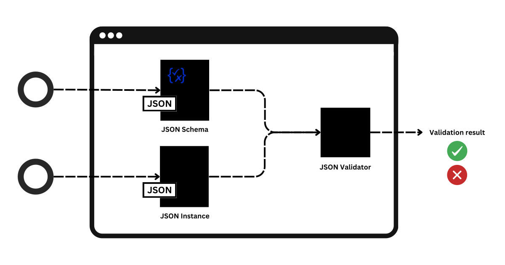
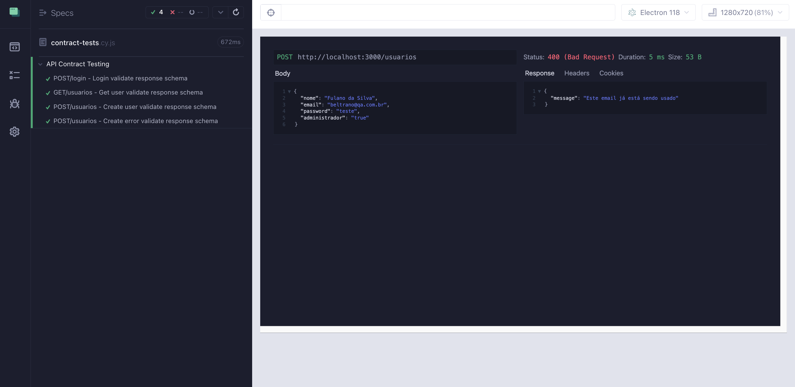

# 🚀 Cypress Contract Testing
Este repositório demonstra como realizar Testes de Contrato de API usando Cypress com validação de esquemas JSON por meio da biblioteca AJV (Another JSON Schema Validator).

## 📚 Índice

- [📋 Visão Geral](#visao-geral)
- [⚙️ Configuração do Projeto](#configuracao-do-projeto)
- [🛠️ Comando Personalizado](#comando-personalizado)
- [📂 Estrutura de Diretórios](#estrutura-diretorio)
- [🚀 Executando os Testes](#executando-testes)
- [✨ Links Uteis](#links-uteis)


<a name="visao-geral"></a>
### 📋 Visão Geral
Os Testes de Contrato de API asseguram que as respostas de uma API estejam de acordo com o esquema esperado, garantindo a consistência dos dados. Utilizamos o Cypress para fazer as requisições HTTP e o AJV para validar os esquemas de resposta.

<br>
  

* ```JSON Schema```: Define a estrutura e as regras que um JSON deve seguir;
* ```JSON Instance```: Objeto JSON real que será validado contra o schema;

<a name="configuracao-do-projeto"></a>
### ⚙️ Configuração do Projeto
#### Pré-requisitos
* ```Node.js```
* ```Cypress```
* ```AJV```

#### Passos para configuração
Rodar o projeto [ServeRest](https://github.com/ServeRest/ServeRest) de forma local, seguindo a documentação do projeto.


Clone o repositório:

```
git clone https://github.com/janzolini/contract-tests-cypress.git
```
#### Instale as dependências:

```
npm install
```

<a name="comando-personalizado"></a>
### 🛠️ Comando Personalizado
```validateSchema``` este comando personalizado do Cypress utiliza a biblioteca AJV para validar o corpo da resposta de uma API contra um esquema JSON.

``` JS
Cypress.Commands.add('validateSchema', (responseBody, schema) => {
    const Ajv = require('ajv');
    const ajv = new Ajv({ allErrors: true, useDefaults: true, coerceTypes: true });

    // Valida se o esquema fornecido é válido
    if (!ajv.validateSchema(schema)) {
        const schemaErrors = ajv.errors.map(error => `Path: ${error.instancePath} - Error: ${error.message}`).join('\n');
        throw new Error(`O esquema é inválido:\n${schemaErrors}`);
    }

    // Compila o esquema e valida o corpo da resposta
    const validate = ajv.compile(schema);
    const valid = validate(responseBody);

    // Se houver erros na validação, lança uma exceção com os detalhes
    if (!valid) {
        const dataErrors = validate.errors.map(error => `Path: ${error.instancePath} - Error: ${error.message}`).join('\n');
        throw new Error(`Validação dos dados falhou:\n${dataErrors}`);
    }

    // Espera que a validação tenha sido bem-sucedida
    expect(valid).to.be.true;
});
```

<a name="estrutura-diretorio"></a>
### 📂 Estrutura de Diretórios
``` bash
cypress-contract-testing/
│
├── cypress/
│   ├── fixtures/
│   │   └── swagger.json
│   ├── integration/
│   │   └── contract-tests.cy.js
│   ├── schemas/
│   │   └── **-schema.json
│   └── support/
│       └── commands.js
│       └── e2e.js
├── cypress.config.js
├── package.json
└── README.md
```

<a name="executando-testes"></a>
### 🚀 Executando os Testes
Para executar os testes de contrato de API, você pode usar os seguintes comandos:

Abrir o Cypress com interface gráfica:

``` bash
npx cypress open
```
Executar os testes no modo headless:

``` bash
npx cypress run
```


<a name="links-uteis"></a>
### ✨ Links Uteis

* [ServeRest](https://github.com/ServeRest/ServeRest)
* [json-schema](https://json-schema.org/overview/what-is-jsonschema)
* [json-to-json-schema](https://transform.tools/json-to-json-schema)
